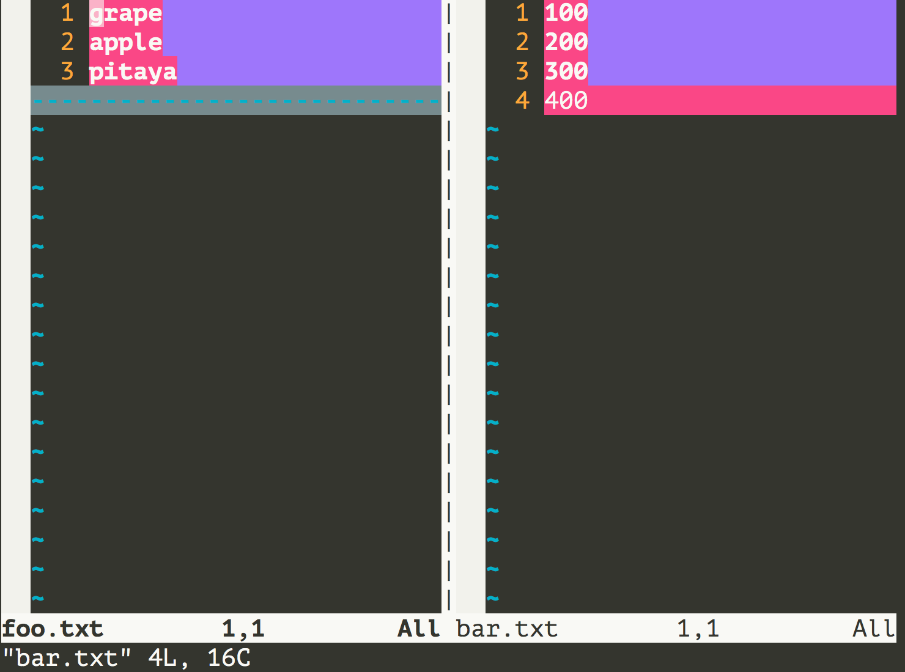
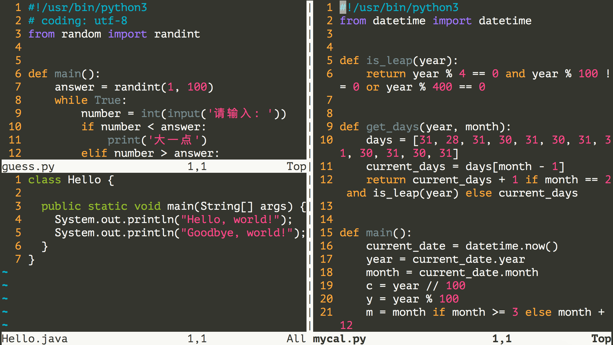
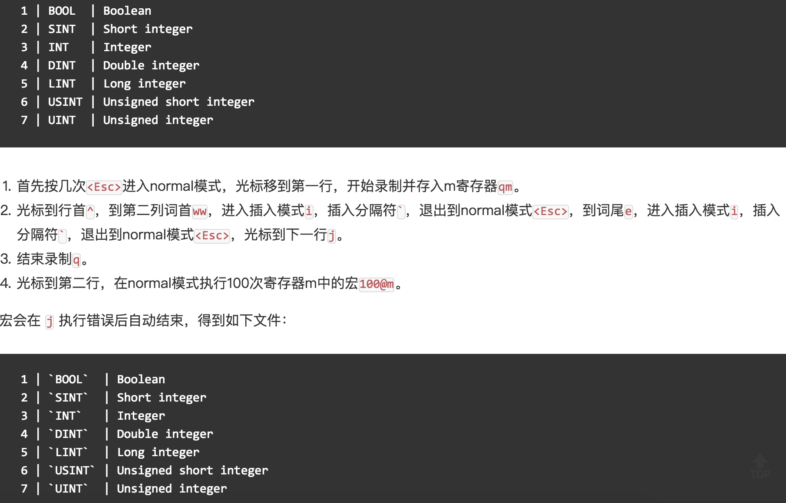

## Linux操作系统 - 文本编辑

### 文本编辑器 - vim

1. **启动vim**。可以通过`vi`或`vim`命令来启动vim，启动时可以指定文件名来打开一个文件，如果没有指定文件名，也可以在保存的时候指定文件名。

   ```Shell
   [root@iZwz97tbgo9lkabnat2lo8Z ~]# vim guess.py
   ```

2. **命令模式**、编辑模式和末行模式：启动vim进入的是命令模式（也称为Normal模式），在命令模式下输入英文字母`i`会进入编辑模式（Insert模式），屏幕下方出现`-- INSERT --`提示；在编辑模式下按下`Esc`会回到命令模式，此时如果输入英文`:`会进入末行模式，在末行模式下输入`q!`可以在不保存当前工作的情况下强行退出vim；在命令模式下输入`v`会进入可视模式（Visual模式），可以用光标选择一个区域再完成对应的操作。

   ```
   在命令模式中:
   !ip address : 查看内网ip地址
   ！ifconfig  : 查看内网ip地址
   dd          : 删除一行
   5dd         : 删除光标所在行的第5行(包括光标所在行)
   ctrl + r    : 还原
   G           : 将光标移到最后一行
   H / gg      : 将光标移到第一行
   5G          : 将光标移到第5行(5随意指定)
   ctrl + f / b :后翻一页/前翻一页
   : w/q/q! 保存/退出/强退
   : wq : 保存退出
   ```

3. **保存和退出vim**：在命令模式下输入`:` 进入末行模式，输入`wq`可以实现保存退出；如果想放弃编辑的内容输入`q!`强行退出，这一点刚才已经提到过了；在命令模式下也可以直接输入`ZZ`实现保存退出。如果只想保存文件不退出，那么可以在末行模式下输入`w`；可以在`w`后面输入空格再指定要保存的文件名。

4. **光标操作**。

   - 在命令模式下可以通过`h`、`j`、`k`、`l`来控制光标向左、下、上、右的方向移动，可以在字母前输入数字来表示移动的距离，例如：`10h`表示向左移动10个字符。
   - 在命令模式下可以通过`Ctrl+y`和`Ctrl+e`来实现向上、向下滚动一行文本的操作，可以通过`Ctrl+f`和`Ctrl+b`来实现向前和向后翻页的操作。
   - 在命令模式下可以通过输入英文字母`G`将光标移到文件的末尾，可以通过`gg`将光标移到文件的开始，也可以通过在`G`前输入数字来将光标移动到指定的行。

5. **文本操作**。

   - 删除：在命令模式下可以用`dd`来删除整行；可以在`dd`前加数字来指定删除的行数；可以用`d$`来实现删除从光标处删到行尾的操作，也可以通过`d0`来实现从光标处删到行首的操作；如果想删除一个单词，可以使用`dw`；如果要删除全文，可以在输入`:%d`（其中`:`用来从命令模式进入末行模式）。
   - 复制和粘贴：在命令模式下可以用`yy`来复制整行；可以在`yy`前加数字来指定复制的行数；可以通过`p`将复制的内容粘贴到光标所在的地方。
   - 撤销和恢复：在命令模式下输入`u`可以撤销之前的操作；通过`Ctrl+r`可以恢复被撤销的操作。
   - 对内容进行排序：在命令模式下输入`%!sort`。

6. **查找和替换**。

   - 查找操作需要输入`/`进入末行模式并提供正则表达式来匹配与之对应的内容，例如：`/doc.*\.`，输入`n`来向前搜索，也可以输入`N`来向后搜索。
   - 替换操作需要输入`:`进入末行模式并指定搜索的范围、正则表达式以及替换后的内容和匹配选项，例如：`:1,$s/doc.*/hello/gice`，其中：
     - `g` - global：全局匹配。
     - `i` - ignore case：忽略大小写匹配。
     - `c` - confirm：替换时需要确认。
     - `e` - error：忽略错误。

7. **参数设定**：在输入`:`进入末行模式后可以对vim进行设定。

   - 设置Tab键的空格数：`set ts=4`

   - 设置显示/不显示行号：`set nu` / `set nonu`

   - 设置启用/关闭高亮语法：`syntax on` / `syntax off`

   - 设置显示标尺（光标所在的行和列）： `set ruler`

   - 设置启用/关闭搜索结果高亮：`set hls` / `set nohls`

     > 说明：如果希望上面的这些设定在每次启动vim时都能生效，需要将这些设定写到用户主目录下的.vimrc文件中。

8. **高级技巧**

   - 比较多个文件。

     ```Shell
     
     [root@iZwz97tbgo9lkabnat2lo8Z ~]# vim -d foo.txt bar.txt
     ```
     

   - 打开多个文件。

     ```Shell
     [root@iZwz97tbgo9lkabnat2lo8Z ~]# vim foo.txt bar.txt hello.txt
     ```

     启动vim后只有一个窗口显示的是foo.txt，可以在末行模式中输入`ls`查看到打开的三个文件，也可以在末行模式中输入`b <num>`来显示另一个文件，例如可以用`:b 2`将bar.txt显示出来，可以用`:b 3`将hello.txt显示出来。

   - 拆分和切换窗口。

     可以在末行模式中输入`sp`或`vs`来实现对窗口的水平或垂直拆分，这样我们就可以同时打开多个编辑窗口，通过按两次`Ctrl+w`就可以实现编辑窗口的切换，在一个窗口中执行退出操作只会关闭对应的窗口，其他的窗口继续保留。

     

   - 映射快捷键：在vim下可以将一些常用操作映射为快捷键来提升工作效率。
     - 例子1：在命令模式下输入`F4`执行从第一行开始删除10000行代码的操作。

       `:map <F4> gg10000dd`。

       例子2：在编辑模式下输入`__main`直接补全为`if __name__ == '__main__':`。

       `:inoremap __main if __name__ == '__main__':`

     > 说明：上面例子2的`inoremap`中的`i`表示映射的键在编辑模式使用， `nore`表示不要递归，这一点非常重要，否则如果键对应的内容中又出现键本身，就会引发递归（相当于进入了死循环）。如果希望映射的快捷键每次启动vim时都能生效，需要将映射写到用户主目录下的.vimrc文件中。

   - 录制宏。

     - 在命令模式下输入`qa`开始录制宏（其中`a`是寄存器的名字，也可以是其他英文字母或0-9的数字）。

     - 执行你的操作（光标操作、编辑操作等），这些操作都会被录制下来。

     - 如果录制的操作已经完成了，按`q`结束录制。

     - 通过`@a`（`a`是刚才使用的寄存器的名字）播放宏，如果要多次执行宏可以在前面加数字，例如`100@a`表示将宏播放100次。

     - 可以试一试下面的例子来体验录制宏的操作，该例子来源于[Harttle Land网站](https://harttle.land/tags.html#Vim)，该网站上提供了很多关于vim的使用技巧，有兴趣的可以去了解一下。

       


